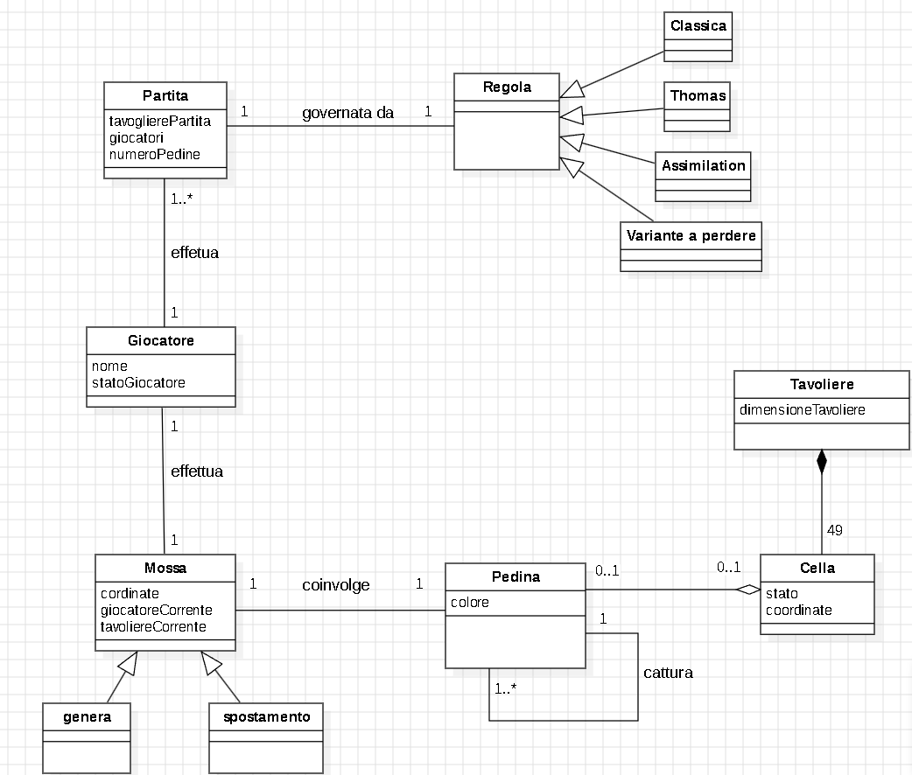

# Report

## **1. Introduzione**

---------
**Ataxx** è un gioco astratto di strategia che coinvolge due giocatori su una griglia di sette per sette caselle. L’obiettivo del gioco è che un giocatore abbia la maggioranza delle pedine sulla scacchiera alla fine della partita, convertendo il maggior numero possibile di pedine dell’avversario. Ogni giocatore inizia con due pedine, di colore appartenete alla propria squadra, generalmente si ha una squadra rossa e una blu, che corrisponderanno ai colori delle pedine. Durante il proprio turno, i giocatori possono scegliere di compiere una di due mosse consentite. Le distanze diagonali sono equivalenti alle distanze ortogonali, quindi è possibile spostarsi su una casella la cui posizione relativa sia a due caselle di distanza sia verticalmente che orizzontalmente e in obliquo. Se la destinazione è adiacente alla casella di partenza, viene creata una nuova pedina sulla casella di partenza vuota. Dopo la mossa, tutte le pedine dell’avversario adiacenti alla casella di destinazione vengono convertite nel colore del giocatore che si è mosso. I giocatori devono muovere a meno che non sia possibile effettuare una mossa legale, in tal caso devono passare. La partita termina quando tutte le caselle sono state riempite o uno dei giocatori non ha più pedine.

Il software è una versione semplificata che rispetta specifici requisiti funzionali.

## **2. Il modello di dominio**
__________

## **3. Requisiti specifici**
_________

### **3.1 Requisiti funzionali**

- **RF1**: Come giocatore voglio mostrare l'help con elenco comandi.

        Al comando /help o invocando l'app con flag --help o -h 
        
        Il risultato è una descrizione concisa che normalmente appare all'avvio del programma, seguita
        dalla lista di comandi disponibili, uno per riga come da esempio successivo:
       
        • gioca
        • esci
        • ..

            
