# Report

## Indice
- [1. Introduzione]( #1-introduzione)
- [2. Modello di dominio](#2-il-modello-di-dominio)
- [3. Requisiti specifici](#3-requisiti-specifici)
    - [3.1 Requisiti funzionali](#31-requisiti-funzionali)
    - [3.2 Requisiti non funzionali](#32-requisiti-non-funzionali)
- [4. System Design](#4-system-Design)
- [5. OO Design](#5-oo-design) 
   - [5.1 Diagramma delle classi](#51-diagramma-delle-classi)
   - [5.2 Diagrammi di sequenza](#52-diagrammi-di-sequenza)
   - [5.3 Commentare le decisioni prese](#53-commentare-le-decisioni-prese)
- [6. Riepilogo del test](#6-riepilogo-del-test)     
- [7. Manuale utente](#7-manuale-utente)
- [8. Processo di sviluppo e organizzazione del lavoro](#8-processo-di-sviluppo-e-organizzazione-del-lavoro) 
- [9. Analisi retrospettiva](#9-analisi-retrospettiva)
    - [9.1 Sprint 0](#91-sprint-0)
    - [9.2 Sprint 1](#92-sprint-1)
    

## **1. Introduzione**

---------
**Ataxx** è un gioco astratto di strategia che coinvolge due giocatori su una griglia di sette per sette caselle. L’obiettivo del gioco è che un giocatore abbia la maggioranza delle pedine sulla scacchiera alla fine della partita, convertendo il maggior numero possibile di pedine dell’avversario. 

Ogni giocatore inizia con due pedine, di colore appartenete alla propria squadra, generalmente si ha una squadra rossa e una blu, che corrisponderanno ai colori delle pedine. Durante il proprio turno, i giocatori possono scegliere di compiere una di due mosse consentite. Le distanze diagonali sono equivalenti alle distanze ortogonali, quindi è possibile spostarsi su una casella la cui posizione relativa sia a due caselle di distanza sia verticalmente che
orizzontalmente e in obliquo. Se la destinazione è adiacente alla casella di partenza, viene creata una nuova pedina sulla casella di partenza vuota. Dopo la mossa, tutte le pedine dell’avversario adiacenti alla casella di destinazione vengono convertite nel colore del giocatore che si è mosso. I giocatori devono muovere a meno che non sia possibile effettuare una mossa legale, in tal caso devono passare. La partita termina quando tutte le caselle sono state riempite o uno dei giocatori non ha più pedine.

Il software è una versione semplificata che rispetta specifici requisiti funzionali.

## **2. Il modello di dominio**
__________

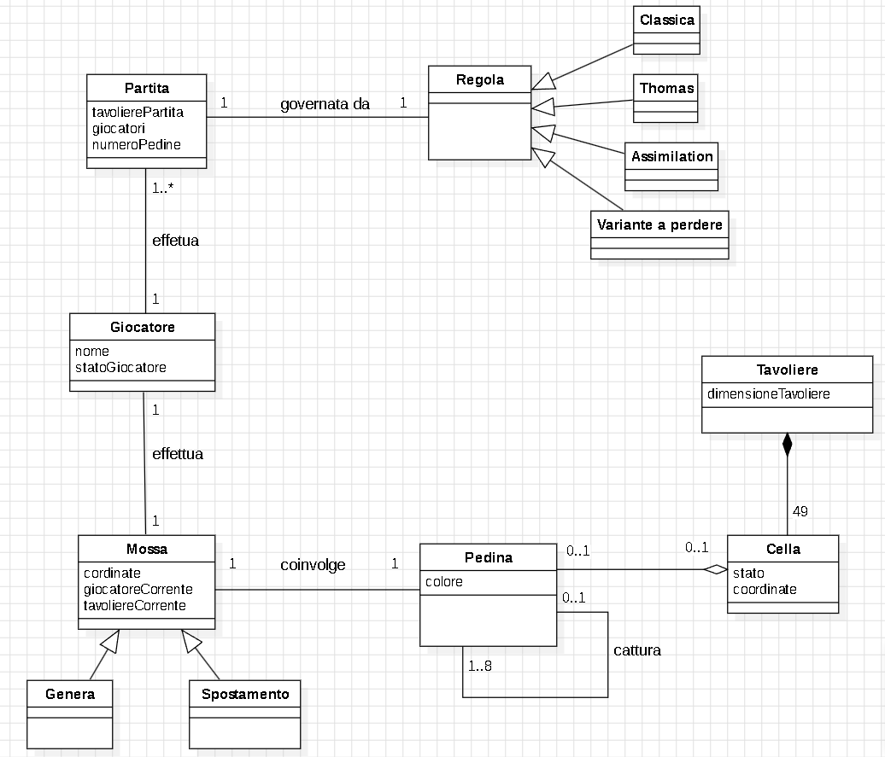

## **3. Requisiti specifici**
_________

### **3.1 Requisiti funzionali**

- **RF1**: Come giocatore voglio mostrare l'help con elenco comandi.

        Al comando /help o invocando l'app con flag --help o -h 
        
        Il risultato è una descrizione concisa che normalmente appare all'avvio del programma, seguita
        dalla lista di comandi disponibili, uno per riga come da esempio successivo:
       
        • gioca
        • esci
        • ..
- **RF2**: Come giocatore voglio iniziare una nuova partita.

            Al comando /gioca 
            
            Se nessuna partita è in corso l'app mostra il tavoliere con le pedine in posizione iniziale
            come in figura e si predispone a ricevere la prima mossa di gioco del nero o altri comandi.

  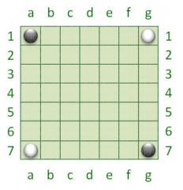
  
- **RF3**: Come giocatore voglio mostrare il tavoliere vuoto con la numerazione.

        Al comando /vuoto
        
        L'app mostra il tavoliere vuoto di 49 caselle quadrate (7 per lato) con le righe numerate da 1 a 7 e
        le colonne numerate da ‘a’ a ‘g’.

- **RF4**: Come giocatore voglio mostrare il tavoliere con le pedine e la numerazione.
        
        Al comando /tavoliere

        • se il gioco non è iniziato l'app suggerisce il comando gioca
        • se il gioco è iniziato l'app mostra la posizione di tutte le pedine sul tavoliere; le pedine sono
        mostrate in formato Unicode https://en.wikipedia.org/wiki/English_draughts#Unicode

- **RF5**: Come giocatore voglio mostrare il tavoliere con le pedine e la numerazione.
        
        Al comando /tavoliere

        • se il gioco non è iniziato l'app suggerisce il comando gioca
        • se il gioco è iniziato l'app mostra la posizione di tutte le pedine sul tavoliere; le pedine sono
        mostrate in formato Unicode https://en.wikipedia.org/wiki/English_draughts#Unicode

- **RF5**: Come giocatore voglio visualizzare le mosse possibili di una pedina.
        
        All comando /qualimosse
        
        • Se il gioco non è iniziato l'app suggerisce il comando gioca
        • Se il gioco è iniziato l'app mostra quali mosse sono disponibili per il giocatore di turno,
        evidenziando
        
        a) in giallo le caselle raggiungibili con mosse che generano una nuova pedina
        b) in arancione raggiungibili con mosse che consentono un salto
        c) in rosa le caselle raggiungibili con mosse di tipo a) o b)

  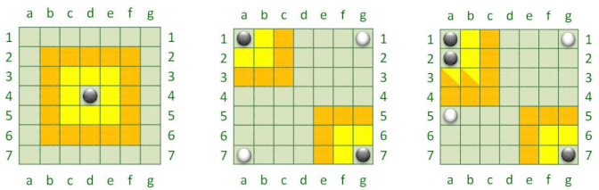

- **RF6**: Come giocatore voglio abbandonare la partita.

        Al comando /abbandona
        l'applicazione chiede conferma
        
        • se la conferma è positiva, l'app comunica che il Bianco (o Nero) ha vinto per abbandono e dichiara
        come vincitore l’avversario per x a 0 dove x è il numero di pedine rimaste dell’avversario.
        
        • se la conferma è negativa, l'app si predispone a ricevere nuovi tentativi o comandi.

- **RF7**: Come giocatore voglio chiudere il gioco.
        
        Al comando /esci
        l'applicazione chiede conferma
        
        
        • Se la conferma è positiva, l'app si chiude restituendo il controllo al sistema operativo
        • Se la conferma è negativa, l'app si predispone a ricevere nuovi tentativi o comandi

- **RF8**: Come giocatore voglio giocare una nuova pedina in una casella adiacente a una propria pedina

      A partita in corso di gioco, l'applicazione deve accettare che il giocatore di turno giochi sul tavoliere una nuova pedina (bianca o nera) in una casella adiacente (in senso ortogonale e diagonale) ad un'altra in cui vi sia già una propria pedina, utilizzando una notazione algebrica del tipo: a1-a2, dove a1 è la casella di partenza e a2 è la casella adiacente.

- **RF9**: Come giocatore voglio spostare una propria pedina saltando una casella adiacente

      A partita in corso di gioco, l'app deve accettare che il giocatore di turno sposti sul tavoliere una propria pedina (bianca o nera) con il salto di una casella adiacente, utilizzando una notazione algebrica del tipo: a1-a3, dove a1 è la casella di partenza e a3 è la casella di arrivo.

      La casella di arrivo deve essere libera e non deve essere adiacente alla casella originaria.

      La casella saltata può anche essere occupata da una propria pedina o da una pedina avversaria.

- **RF10**: Come giocatore voglio catturare una pedina avversaria come effetto di una mossa

      Se al termine di una mossa vi sono pedine avversarie adiacenti alla casella di arrivo, sia per la mossa di espansione che di spostamento, queste vengono catturate cambiando di colore.

- **RF11**: Come giocatore voglio mostrare le mosse giocate

      Al comando /mosse, l'app mostra la storia delle mosse con notazione algebrica, per esempio: 
      • a1-a2 (N); 
      • g7-g6 (B);

- **RF12**: Come giocatore voglio passare il turno per impossibilità di movimento

      Se il giocatore non può muovere nessuna pedina del proprio colore, l’app avvisa che il turno passa all’altro colore.

- **RF13**: Come giocatore voglio visualizzare il fine partita con il vincitore e i punti segnati

      Se nessuna pedina può essere mossa perché le caselle del tavoliere sono state tutte riempite, allora l’app dichiara il vincitore (Bianco o Nero) e riporta i punti del Bianco e Nero contando le rispettive pedine.

      L'app si predispone a ricevere nuovi comandi.

- **RF14**: Come giocatore voglio mostrare il tempo di gioco

      Al comando /tempo, l'app mostra il tempo trascorso dall’inizio partita nel formato ore:minuti:secondi.

- **RF15**: Come giocatore voglio impostare caselle non accessibili

      A partita non in corso, al comando /blocca xn, dove xn sono le coordinate di una casella, la casella xn non è accessibile per le pedine ed è mostrata sul tavoliere con uno sfondo grigio.

      Non è possibile bloccare:
      
      • le caselle di partenza del gioco;
      • tutte le caselle adiacenti a una casella di partenza del gioco, rendendo impossibile la mossa di espansione di una pedina a inizio gioco;
      • tutte le caselle a distanza 2 da una casella di partenza del gioco, rendendo impossibile la mossa di salto di una pedina a inizio gioco. 
      
      Non è possibile bloccare più di 9 caselle.

### **3.2 Requisiti non funzionali**

- **RNF1**: Il container docker dell’app deve essere eseguito da terminali che supportano Unicode con encoding UTF-8 o UTF-16.

       Elenco di terminali supportati
      
      Linux:
      - terminal

      Windows:
      - Powershell
      - Git Bash (in questo caso il comando Docker ha come prefisso winpty; es: winpty docker -it ....)

      Comando per l’esecuzione del container
      
      Dopo aver eseguito il comando docker pull copiandolo da GitHub Packages, Il comando Docker da usare per
      eseguire il container contenente l’applicazione è:

      docker run --rm -it ghcr.io/softeng2324-inf-uniba/ataxx-base:latest

      dove base sarà sostituito con il nome del gruppo.

## **4. System Design**
__________

Il *System Design* viene principalmente adottato nella progettazione di software di alto livello e consiste nell'identificazione dei principali componenti e delle relazioni tra questi.  
Solitamente, l'architettura di un software deve essere definita nella prima fase di progettazione (inizio fase Sprint 1), ma il nostro Team non ha ritenuto importante applicare uno stile architetturale ben preciso.

Di conseguenza non c'è stato alcun modo di rappresentarlo e difatto non è stato necessario realizzare nessun diagramma a tale scopo.
Nonostante l'assenza di tutto ciò, si è comunque seguito lo stile di un sistema software robusto e di facile comprensione.  
Infine, si è cercato di rispettare i 4 principi sui cambiamenti ideali, applicando appieno il **principio di Information Hiding**.

## **5. OO Design**
__________
  ### **5.1 Diagramma delle classi**

  ### **5.2 Diagrammi di sequenza**

  ### **5.3 Commentare le decisioni prese**

## **6. Riepilogo del test**
__________

## **7. Manuale utente**
__________
**1.** Il gioco si avvia presentando il titolo, e la possibilità di accedere al comando help, tutto seguito da un invito all'utente di digitare un comando.

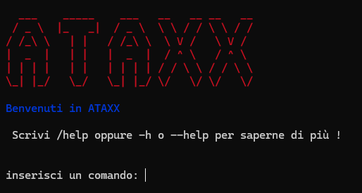

**2.** Il comando *'/gioca'* permette di avviare il gioco, presentando prima le regole di gioco da intraprendere e successivamente la richiesta dei nomi che verranno attribuiti ai due giocatori all'interno della partita.

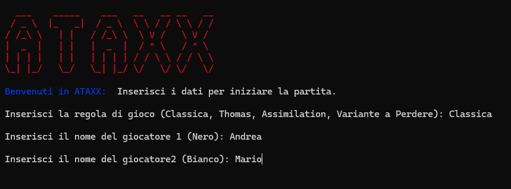

**3.** Successivamente al comando *'/gioca'* viene mostrato ai due giocatori il Tavoliere di gioco con all'interno le loro pedine, contraddistinte da due diversi colori, posizionate nei quattro angoli.

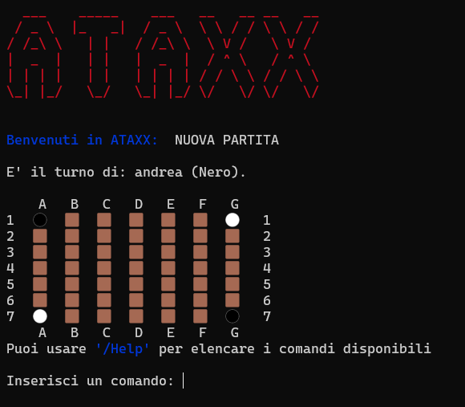

**4.** Il comando *'/help'* permette al giocatore di ricevere delle informazioni generali riguardanti il gioco, le modalità con la quale potrà inserire le coordinate delle celle in modo da poter giocare, tutto ciò seguito dall' elenco dei comandi con la propria descrizione, specificando dove posso essere utilizzati all'interno del gioco.

E' possibile avviare il comando attraverso i flag *'-h'* / *'--help'* . Verrà visualizzato quindi il comando

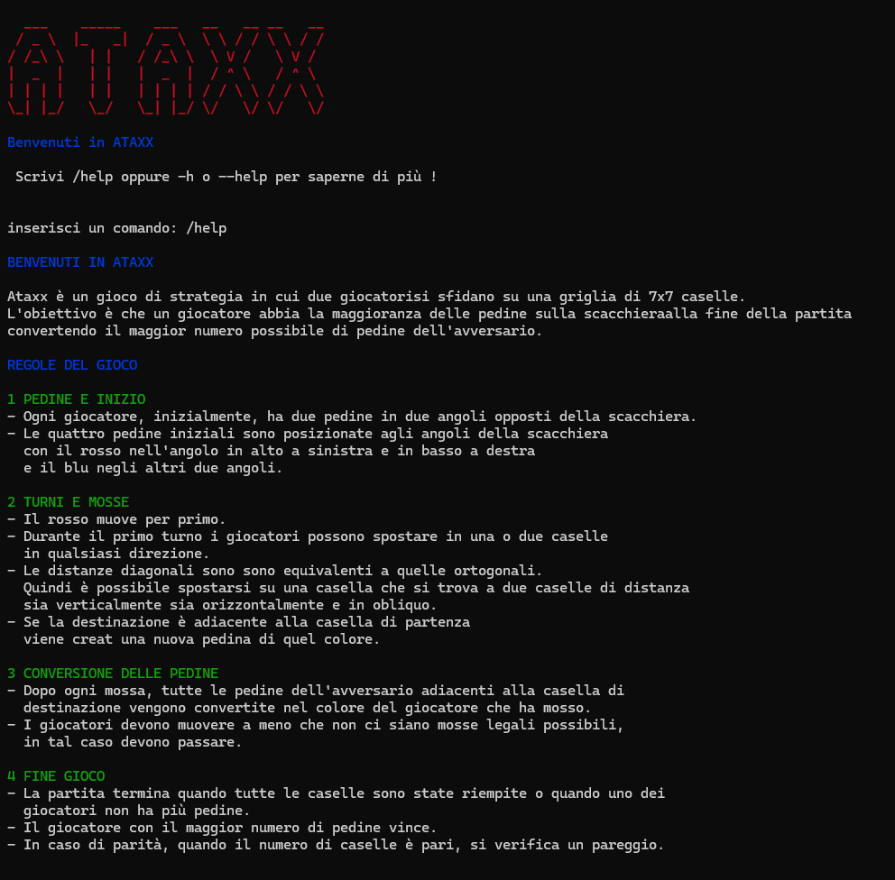
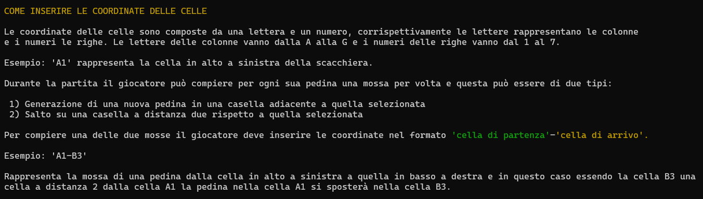
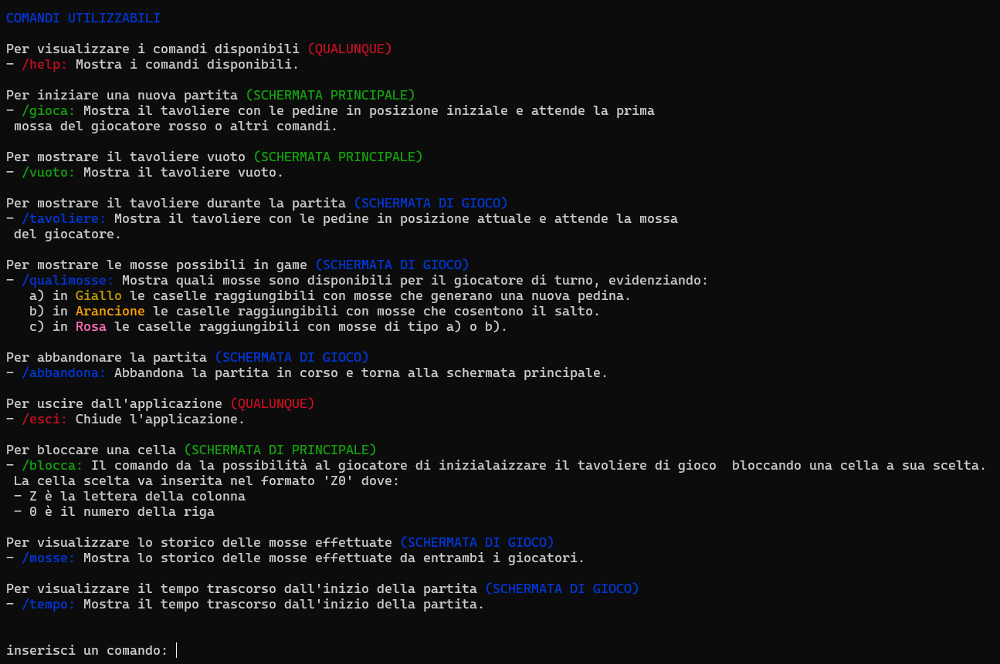

**5.** Il comando *'/qualiMosse'* indica al giocatore corrente tutte le posizioni delle celle in cui la propria pedina potrà essere spostata all'interno del Tavoliere di gioco, le posizioni in cui sarà possibile generare nuove pedine e le posizioni in cui sarà possibile effettuare entrambe le mosse precedentemente descritte. Le celle adiacenti alle pedine del giocatore corrente, indicate con la colorazione gialla, indicano la possibilità di generazione di ulteriori pedine da parte del giocatore. Le altre celle, indicate con la colorazione arancione, indicano le posizioni possibili in cui il giocatore potrà spostare le sue pedine presenti sul Tavoliere. Inoltre, le altre celle con colorazione rosa, indicano le posizioni possibili in cui il giocatore potrà effettuare sia una mossa di spostamento che una mossa di generazione.

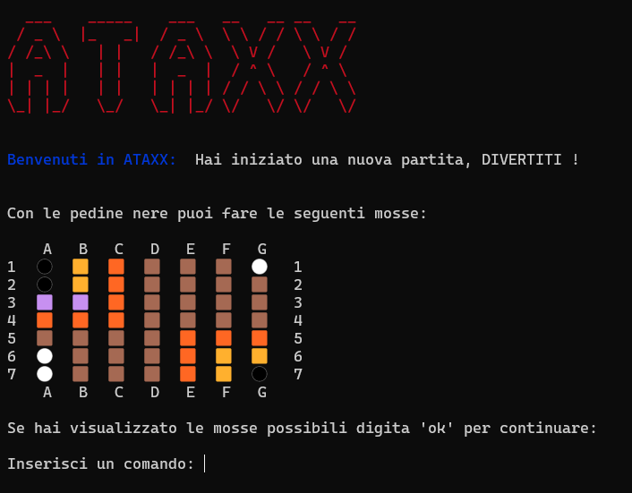

A partita in corso di gioco, il giocatore di turno puo' giocare sul tavoliere una nuova pedina (bianca o nera) in una casella adiacente (in senso ortogonale e diagonale) ad un'altra in cui vi sia già una propria pedina, utilizzando una notazione algebrica del tipo: a1-a2, dove a1 è la casella di partenza e a2 è la casella adiacente.

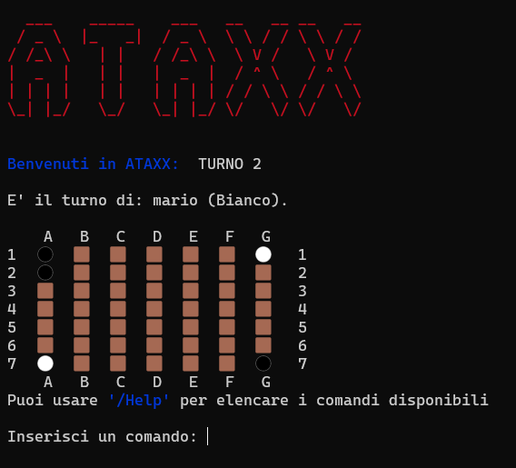

A partita in corso di gioco, il giocatore di turno puo' spostare sul tavoliere una propria pedina (bianca o nera) con il salto di una casella adiacente, utilizzando una notazione algebrica del tipo: g1-e1, dove g1 è la casella di partenza ed e1 è la casella di arrivo.

La casella di arrivo deve essere libera e non deve essere adiacente alla casella originaria.
La casella saltata può anche essere occupata da una propria pedina o da una pedina avversaria.

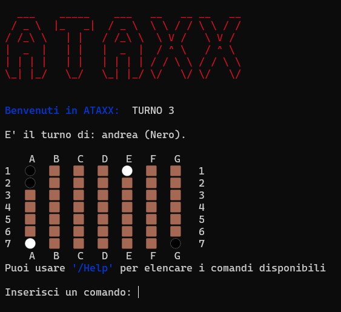

Se al termine di una mossa vi sono pedine avversarie adiacenti alla casella di arrivo, sia per la mossa di generazione che di spostamento, queste vengono catturate cambiando di colore.

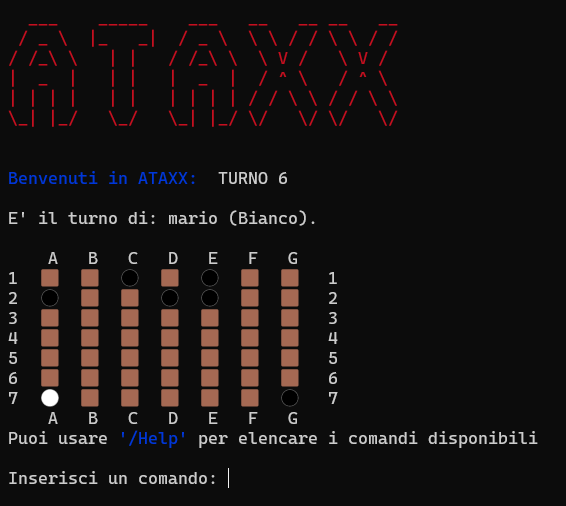

Se le caselle del tavoliere presentano esclusivamente pedine di uno stesso colore, allora l’app dichiara il vincitore (Bianco o Nero) e riporta i punti del Bianco e Nero contando le rispettive pedine.

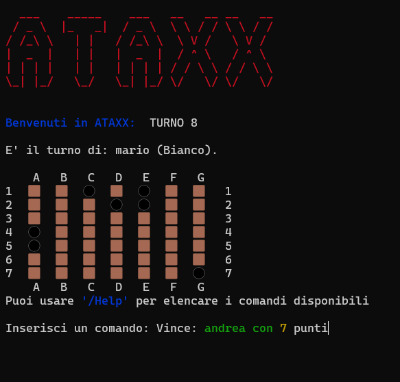

**6.** Il comando *'/vuoto'* permette al giocatore di visualizzare l'intero Tavoliere di gioco privo di qualsiasi pedina al suo interno prima dell'inizio della partita.

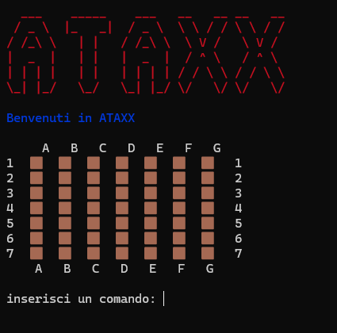

**7.** Il comando *'/tavoliere'* consente al giocatore di vedere la situazione del Tavoliere durante la partita.

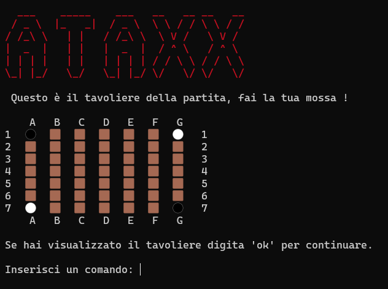

**8.** Il comando *'/tempo'*, consente di mostrare il tempo trascorso dall’inizio partita nel formato ore:minuti:secondi.

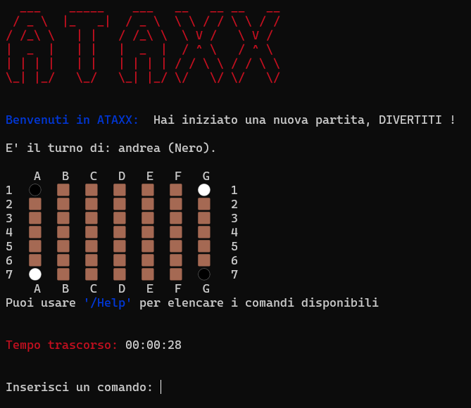

**9.** Il comando *'/mosse'*, mostra la storia delle mosse con notazione algebrica, per esempio: 1. a1-a2 (N); 2. g1-e3 (B);

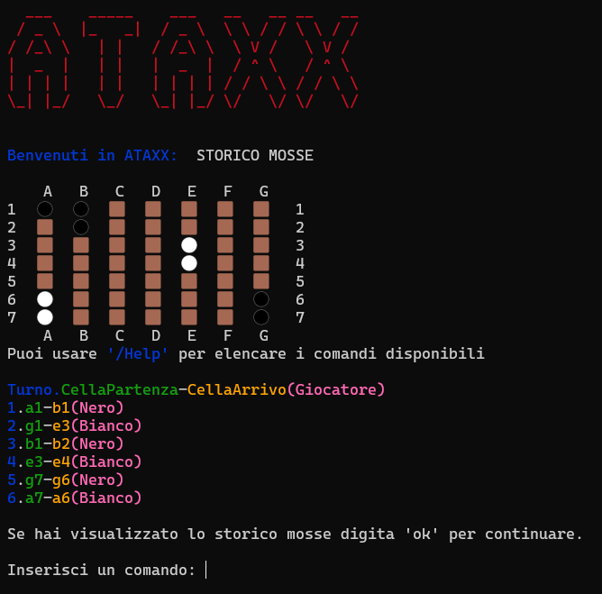

**10.** A partita non in corso, il comando *'/blocca xn'*, dove xn sono le coordinate di una casella, rende non accessibile la casella xn per tutte le pedine. 

La casella bloccata viene mostrata sul tavoliere con un quadratino di colore bianco.

Non è possibile bloccare:
- le caselle di partenza del gioco;
- tutte le caselle adiacenti a una casella di partenza del gioco, rendendo impossibile la mossa di espansione di una pedina a inizio gioco;
- tutte le caselle a distanza 2 da una casella di partenza del gioco, rendendo impossibile la mossa di salto di una pedina a inizio gioco;
- più di 9 caselle in totale.

**11.** Il comando *'/abbandona'* se iniziata la partita, fornisce al giocatore, previo consenso esplicito,la possibilità di uscire dalla partita. In caso di risposta affermativa, il giocatore corrente perderà a tavolino la partita e verrà riportato al menù principale.

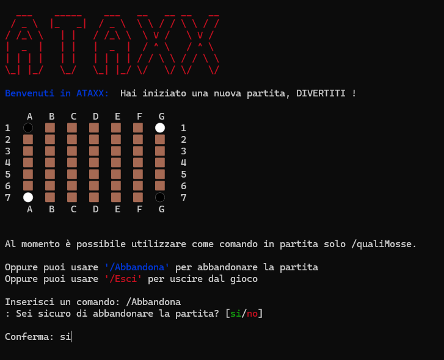

In caso di risposta negativa, il giocatore rimarrà nella partita corrente.

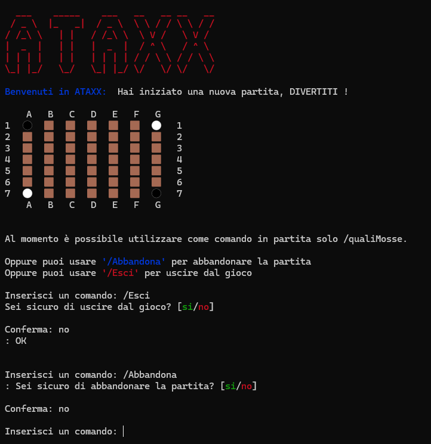

**12.** Il comando *'/esci'* permette all' utente di uscire dal gioco, richiedendo esplicita conferma da parte del giocatore. Nel caso in cui la risposta dell' utente sia affermativa, l'applicazione terminerà.

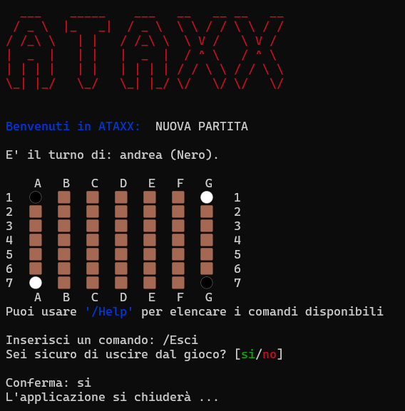

Nel caso di risposta negativa, l'applicazione notificherà all'utente l'avvenuta interruzione del comando, riportandolo nell'applicazione e permettendogli di scegliere un nuovo comando.

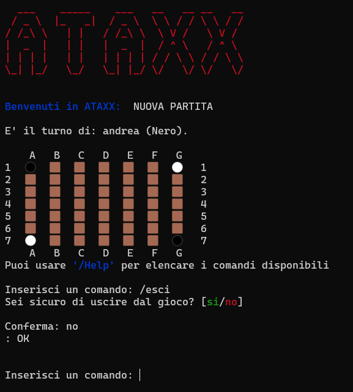

## **8. Processo di sviluppo e organizzazione del lavoro**
__________

Il gruppo di lavoro durante lo svolgimento delle consegne ha perseguito una strategia precisa nell’organizzazione e nella divisione del lavoro.  

Prima dell’inizio del lavoro effettivo per la realizzazione dei requisiti funzionali è stato sempre effettuato un primo incontro di chiarifica, in seguito al lancio di ognuno dei 3 sprint, con tutti i membri del gruppo. In questo incontro sono stati analizzati i seguenti temi:

- **Identificazione e chiarimento dei requisiti funzionali richiesti.**

- **Identificazione dell'ordine di priorità dei requisiti funzionali da implementare.**

- **Assegnazione dei compiti da svolgere ai membri del gruppo.**

Durante il primo incontro di chiarifica sono stati enunciati i requisiti richiesti che il programma doveva rispettare. Ogni requisito è stato poi successivamente analizzato e chiarito in maniera più esaustiva se presenti punti poco chiari o dubbi da parte dei membri del gruppo.

Successivamente una volta individuata la sequenza di realizzazione dei requisiti funzionali da implementare per un corretto sviluppo, alcuni di essi sono stati realizzati in parallelo ottimizzando i tempi di sviluppo, altri invece no, in quanto avrebbero potuto creare dei conflitti se sviluppati in contemporanea ad altri.

Dopo l’incontro iniziale solitamente quasi ogni giorno venivano notificati aggiornamenti riguardanti lo stato di compimento del proprio lavoro di ognuno, così da poter discutere delle modifiche apportate e delle difficoltà incontrate durante lo sviluppo del progetto. A seconda della gravità del problema si decideva se pianificare un incontro per cercare di risolvere insieme le difficoltà incontrate, sempre che queste non potessero essere risolte tramite soluzioni inviate via chat.

Per ognuno dei 3 sprint è stato creato un milestone, chiamato con il nome del relativo sprint, a cui sono stati assegnati tutti gli issue, le pull request e la project board associati allo sprint in corso. 

La project board di ogni sprint prevedeva le seguenti colonne:
- **ToDo**, relativa agli incarichi assegnati, ma il cui lavoro non è ancora iniziato.
- **inProgress**, per i compiti in fase di realizzazione.
- **Review**, per i lavori terminati, ma in attesa di revisione prima del merge.
- **Ready**, per gli incarichi revisionati dai membri del gruppo, di cui è stato effettuato il merge e in attesa della revisione dal product owner.
- **Done**, relativa alle issue portate a termine e confermate dopo la revisione effettuata dal product owner.

Ogni requisito funzionale è stato assegnato ad un membro del gruppo in base alla effettiva difficoltà di realizzazione.
In ogni singola assegnazione è stata lasciata piena libertà nell’autogestirsi sulla divisione del proprio lavoro.
Una volta stabilito il lavoro da svolgere sono stati aperti i rispettivi issue, in base all' ordine prefissato durante il meeting.

Ognuno di noi ha creato sul proprio repository locale un branch, relativo a ciascun issue assegnato, sul quale lavorare, in modo tale da mantenere in locale tutte le modifiche prima di aggiornare il branch remoto. 

Una volta portato a termine il proprio compito ed effettuata la pull request è stato richiesto ad almeno due componenti del gruppo, laddove l'intero team non avrebbe potuto riunirsi, per confermare ed approvare le modifiche effettuate. In alcuni casi la revisione ha portato ad ulteriori modifiche prima che le pull request potessero essere approvate. Nel caso in cui dopo aver confermato le modifiche, in corso d'opera, fosse stata sentita l'esigenza di apportare delle nuove modifiche venivano comunicate al team e create delle issue che andassero ad identificare la modifica da compiere. Dopo di che, come detto precedentemente, ogni membro si assegnava la nuova issue.

Prima della data di consegna del progetto, per ogni sprint, il gruppo si è riunito in un incontro finale per un’ultima revisione prima di confermare al product owner la conclusione del lavoro richiesto.

Durante la  realizzazione del progetto, come ambiente di sviluppo, è stato usato l'IDE Visual Studio Code con plug-in: Gradle, JUnit, Checkstyle, Spotbugs.
Altri Software utilizzati sono stati: 
   - _Docker_ per l'utilizzo di container;
   - _starUML_ per i diagrammi di dominio, delle classi e di flusso;
   - _Visual Studio Code_ per i file markdown e lo sviluppo del codice;
   - _Discord_  per gli incontri e il lavoro comune;
   - _WhatsApp_ per le comunicazioni e le risoluzioni di problemi più semplici.

## **9. Analisi retrospettiva**    
__________
 ### **9.1 Sprint 0**

 La seguente immagine riporta l' analisi retrospettiva dello sprint 0, utilizzando il modello "ARRABBIATO,TRISTE,FELICE".

 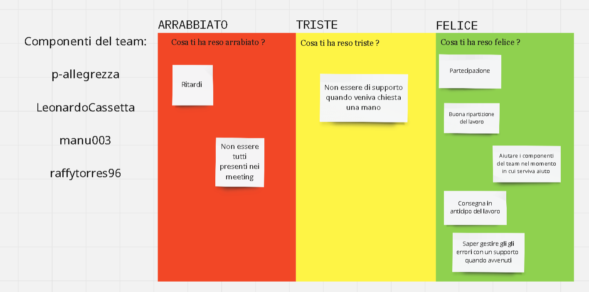

 ### **9.2 Sprint 1**

 La seguente immagine riporta l' analisi retrospettiva dello sprint 1, utilizzando il modello "ARRABBIATO,TRISTE,FELICE".

 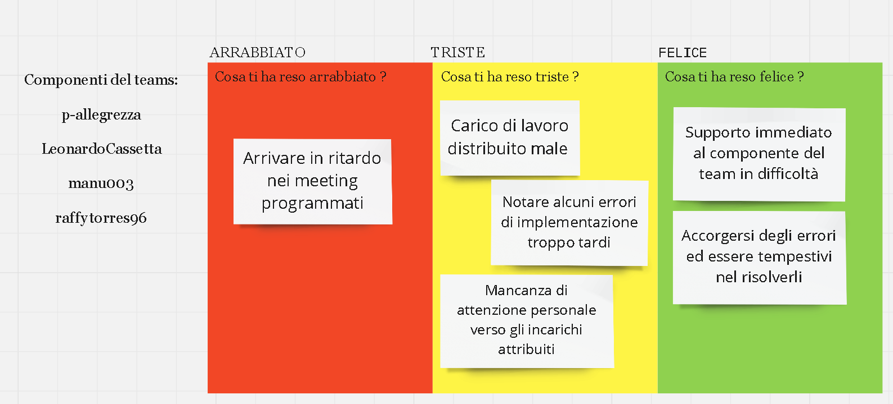

 **SOLUZIONI:**

Per quanto riguarda la sezione arrabbiato della tabella abbiamo stabilito di comunicare tempestivamente eventuali ritardi alla partecipazione del meeting così da consentire al team di organizzarsi e rendere più flessibile la pianificazione del lavoro.

Per quanto riguarda, invece, la sezione triste abbiamo pensato al momento della distribuzione degli incarichi che se un componente del team ritiene che le scelte da lui prese sui compiti da eseguire siano eccessivi deve comunicarlo al gruppo e discuterne con i componenti del team sulla ridistribuzione di quest'ultimi al resto dei componenti. D'altra parte se alcuni componenti del team dovessero accorgersene preventivamente, in fase di assegnazione dei compiti, devono farlo notare.

In secondo luogo, abbiamo stabilito di darci dei feedback giornalieri sul processo di compimento del task su cui si sta lavorando così da potenziare la prevenzione di possibili errori derivanti da incomprensioni sui propri compiti da eseguire. Inoltre, abbiamo deciso durante la fase di revisione di assegnare il ruolo di revisore ad almeno due componenti del team.      

        

            
