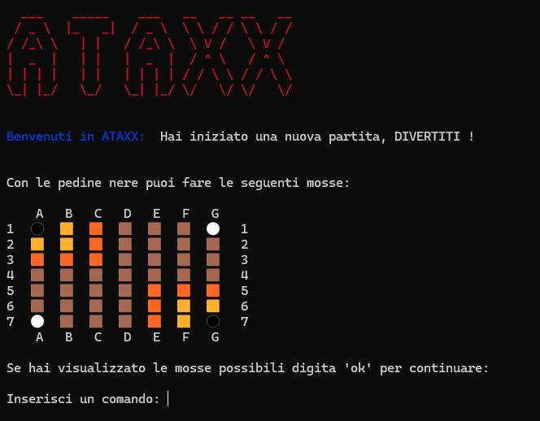

# Report

## Indice
- [1. Introduzione]( #1-introduzione)
- [2. Modello di dominio](#2-il-modello-di-dominio)
- [3. Requisiti specifici](#3-requisiti-specifici)
    - [3.1 Requisiti funzionali](#31-requisiti-funzionali)
    - [3.2 Requisiti non funzionali](#32-requisiti-non-funzionali)
   
- [7. Manuale utente](#7-manuale-utente) 
- [9. Analisi retrospettiva](#9-analisi-retrospettiva)
    - [9.1 Sprint 0](#91-sprint-0)
    

## **1. Introduzione**

---------
**Ataxx** è un gioco astratto di strategia che coinvolge due giocatori su una griglia di sette per sette caselle. L’obiettivo del gioco è che un giocatore abbia la maggioranza delle pedine sulla scacchiera alla fine della partita, convertendo il maggior numero possibile di pedine dell’avversario. 

Ogni giocatore inizia con due pedine, di colore appartenete alla propria squadra, generalmente si ha una squadra rossa e una blu, che corrisponderanno ai colori delle pedine. Durante il proprio turno, i giocatori possono scegliere di compiere una di due mosse consentite. Le distanze diagonali sono equivalenti alle distanze ortogonali, quindi è possibile spostarsi su una casella la cui posizione relativa sia a due caselle di distanza sia verticalmente che
orizzontalmente e in obliquo. Se la destinazione è adiacente alla casella di partenza, viene creata una nuova pedina sulla casella di partenza vuota. Dopo la mossa, tutte le pedine dell’avversario adiacenti alla casella di destinazione vengono convertite nel colore del giocatore che si è mosso. I giocatori devono muovere a meno che non sia possibile effettuare una mossa legale, in tal caso devono passare. La partita termina quando tutte le caselle sono state riempite o uno dei giocatori non ha più pedine.

Il software è una versione semplificata che rispetta specifici requisiti funzionali.

## **2. Il modello di dominio**
__________

## **3. Requisiti specifici**
_________

### **3.1 Requisiti funzionali**

- **RF1**: Come giocatore voglio mostrare l'help con elenco comandi.

        Al comando /help o invocando l'app con flag --help o -h 
        
        Il risultato è una descrizione concisa che normalmente appare all'avvio del programma, seguita
        dalla lista di comandi disponibili, uno per riga come da esempio successivo:
       
        • gioca
        • esci
        • ..
- **RF2**: Come giocatore voglio iniziare una nuova partita.

            Al comando /gioca 
            
            Se nessuna partita è in corso l'app mostra il tavoliere con le pedine in posizione iniziale
            come in figura e si predispone a ricevere la prima mossa di gioco del nero o altri comandi.

  
  
- **RF3**: Come giocatore voglio mostrare il tavoliere vuoto con la numerazione.

        Al comando /vuoto
        
        L'app mostra il tavoliere vuoto di 49 caselle quadrate (7 per lato) con le righe numerate da 1 a 7 e
        le colonne numerate da ‘a’ a ‘g’.

- **RF4**: Come giocatore voglio mostrare il tavoliere con le pedine e la numerazione.
        
        Al comando /tavoliere

        • se il gioco non è iniziato l'app suggerisce il comando gioca
        • se il gioco è iniziato l'app mostra la posizione di tutte le pedine sul tavoliere; le pedine sono
        mostrate in formato Unicode https://en.wikipedia.org/wiki/English_draughts#Unicode

- **RF5**: Come giocatore voglio mostrare il tavoliere con le pedine e la numerazione.
        
        Al comando /tavoliere

        • se il gioco non è iniziato l'app suggerisce il comando gioca
        • se il gioco è iniziato l'app mostra la posizione di tutte le pedine sul tavoliere; le pedine sono
        mostrate in formato Unicode https://en.wikipedia.org/wiki/English_draughts#Unicode

- **RF5**: Come giocatore voglio visualizzare le mosse possibili di una pedina.
        
        All comando /qualimosse
        
        • Se il gioco non è iniziato l'app suggerisce il comando gioca
        • Se il gioco è iniziato l'app mostra quali mosse sono disponibili per il giocatore di turno,
        evidenziando
        
        a) in giallo le caselle raggiungibili con mosse che generano una nuova pedina
        b) in arancione raggiungibili con mosse che consentono un salto
        c) in rosa le caselle raggiungibili con mosse di tipo a) o b)

  

- **RF6**: Come giocatore voglio abbandonare la partita.

        Al comando /abbandona
        l'applicazione chiede conferma
        
        • se la conferma è positiva, l'app comunica che il Bianco (o Nero) ha vinto per abbandono e dichiara
        come vincitore l’avversario per x a 0 dove x è il numero di pedine rimaste dell’avversario.
        
        • se la conferma è negativa, l'app si predispone a ricevere nuovi tentativi o comandi.

- **RF7**: Come giocatore voglio chiudere il gioco.
        
        Al comando /esci
        l'applicazione chiede conferma
        
        
        • Se la conferma è positiva, l'app si chiude restituendo il controllo al sistema operativo
        • Se la conferma è negativa, l'app si predispone a ricevere nuovi tentativi o comandi

### **3.2 Requisiti non funzionali**

- **RNF1**:Il container docker dell’app deve essere eseguito da terminali che supportano Unicode con encoding UTF-8 o UTF-16.

       Elenco di terminali supportati
      
      Linux:
      - terminal

      Windows:
      - Powershell
      - Git Bash (in questo caso il comando Docker ha come prefisso winpty; es: winpty docker -it ....)

      Comando per l’esecuzione del container
      
      Dopo aver eseguito il comando docker pull copiandolo da GitHub Packages, Il comando Docker da usare per
      eseguire il container contenente l’applicazione è:

      docker run --rm -it ghcr.io/softeng2324-inf-uniba/ataxx-base:latest

      dove base sarà sostituito con il nome del gruppo.

## **7. Manuale utente**
__________
**1.** Il gioco si avvia presentando il titolo, e la possibilità di accedere al comando help, tutto seguito da un invito all'utente di digitare un comando.

**2.** Il comando *'/gioca'* permette di avviare il gioco, presentando prima le regole di gioco da intraprendere e successivamente la richiesta dei nomi che verranno attribuiti ai due giocatori all'interno della partita.

**3.** Successivamente al comando *'/gioca'* viene mostrato ai due giocatori il Tavoliere di gioco con all'interno le loro pedine, contraddistinte da due diversi colori, posizionate nei quattro angoli.

**4.** Il comando *'/help'* permette al giocatore di ricevere delle informazioni generali riguardanti il gioco, seguite dall' elenco dei comandi con la propria descrizione, specificando dove posso essere utilizzati all'interno del gioco.

E' possibile avviare il comando attraverso i flag *'-h'* / *'--help'* . Verrà visualizzato quindi il comando

**5.** Il comando *'/qualiMosse'* indica al giocatore corrente tutte le posizioni delle celle in cui la propria pedina potrà essere spostata all'interno del Tavoliere di gioco o le posizioni in cui sarà possibile generare nuove pedine. Le celle adiacenti alle pedine del giocatore corrente, indicate con la colorazione gialla, indicano la possibilità di generazione di ulteriori pedine da parte del giocatore. Le altre celle, indicate con la colorazione arancione, indicano le posizioni possibili in cui il giocatore potrà spostare le sue pedine presenti sul Tavoliere.

**6.** Il comando *'/vuoto'* permette al giocatore di visualizzare l'intero Tavoliere di gioco privo di qualsiasi pedina al suo interno.

**7.** Il comando *'/tavoliere'* consente al giocatore di vedere la situazione del Tavoliere durante la partita.

**8.** Il comando *'/abbandona'* se iniziata la partita, fornisce al giocatore, previo consenso esplicito,la possibilità di uscire dalla partita. In caso di risposta affermativa, il giocatore corrente perderà a tavolino la partita e verrà riportato al menù principale.

In caso di risposta negativa, il giocatore rimarrà nella partita corrente.

**9.** Il comando *'/esci'* permette all' utente di uscire dal gioco, richiedendo esplicita conferma da parte del giocatore. Nel caso in cui la risposta dell' utente sia affermativa, l'applicazione terminerà.

Nel caso di risposta negativa, l'applicazione notificherà all'utente l'avvenuta interruzione del comando, riportandolo nell'applicazione e permettendogli di scegliere un nuovo comando.

## **9. Analisi retrospettiva**    
__________
 ### **9.1 Sprint 0**

 La seguente immagine riporta l' analisi retrospettiva dello sprint 0, utilizzando il modello "ARRABBIATO,TRISTE,FELICE".

 

        

            
